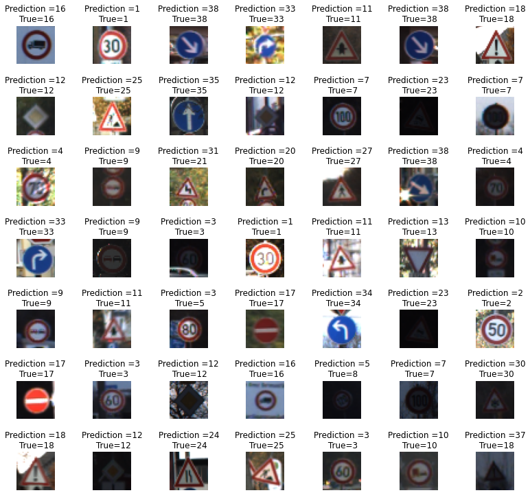

# Achtung!

Autonomous vehicles are not a new topic in our current world anymore. Depending on where you live, self-driving cars may be seen in your neighborhood. There are many factors to consider when it comes to autonomous vehicles. One of them is traffic signs which are a vital part of our daily life. Traffic signs save lives. They provide critical information and recommendations for road users, which requires them to adjust their driving behavior to adhere to whatever road regulation is enforced. 

Traffic signs detection is one of the main aspects of automatic driving. The car should recognize any traffic sign and act according to it quickly. It is obvious that any small mistake can lead to a fatal accident. While classic computer vision approaches can be beneficial, I decided to employ deep learning algorithms to increase accuracy in traffic signs classification tasks.

* Connected and cloned a pickled german traffic sign dataset
* Utilized different preprocessing methods such as pixel brightness transformations (grayscale and adaptive histogram equalization)
* Built the model using convolutional neural network algorithms and improved accuracy up to more than 94%.

Dataset is available to clone from [here](https://bitbucket.org/jadslim/german-traffic-signs)

